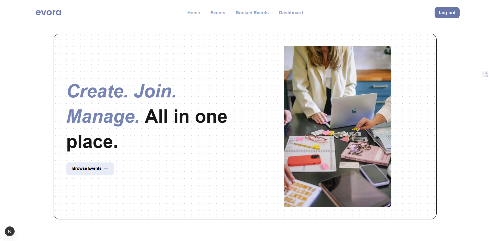
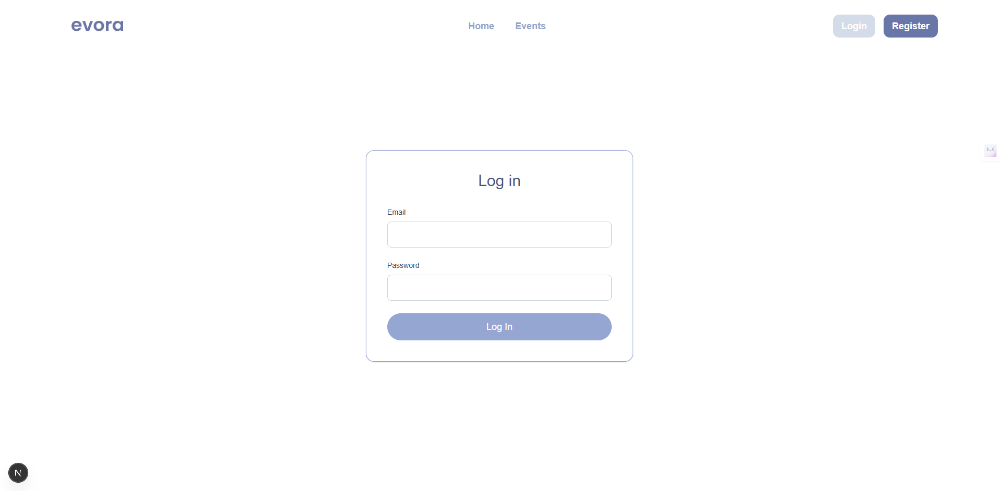
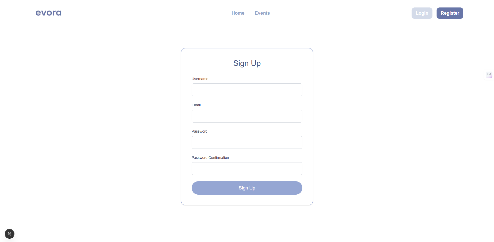
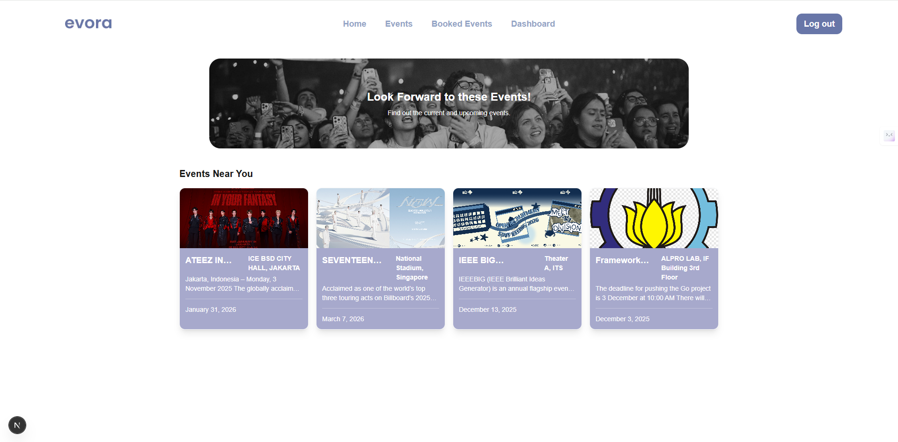
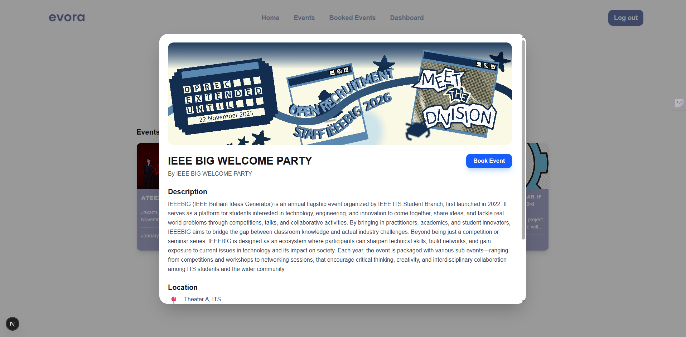
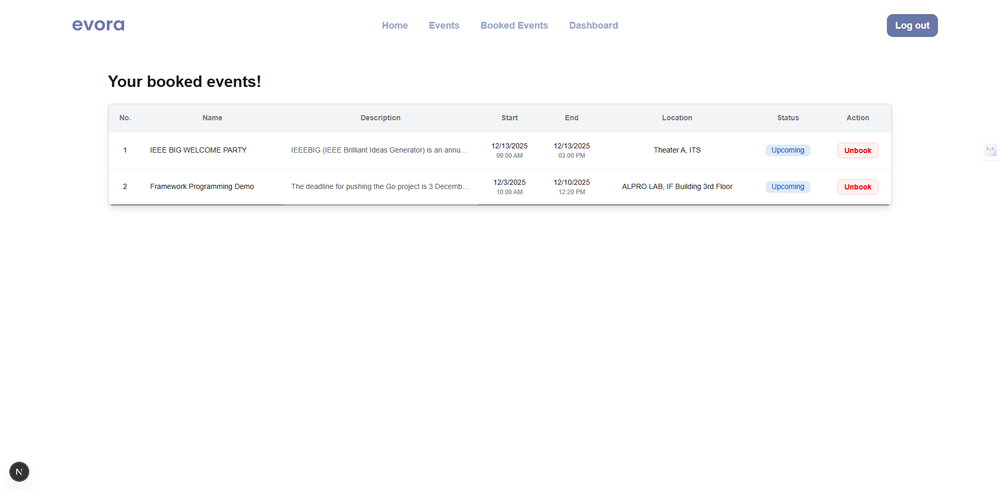
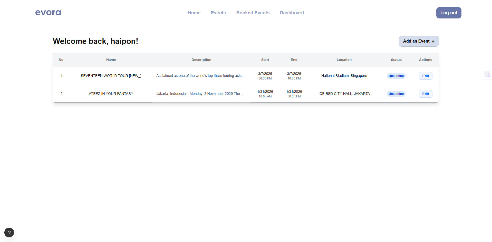
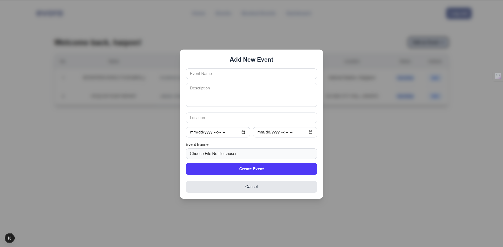
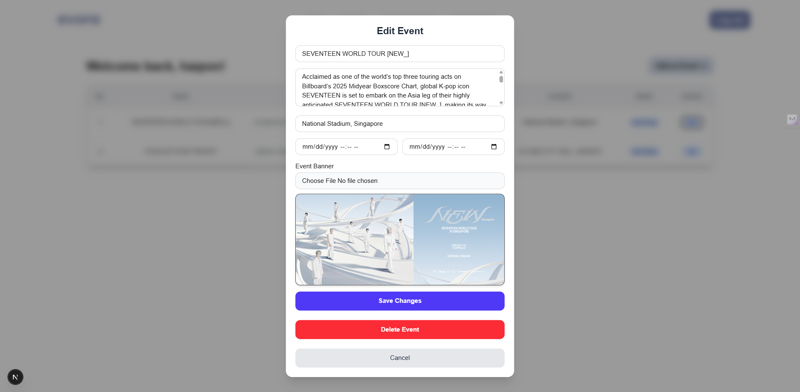

<p align="center">
  
</p>
<br>

# Evora - Event Viewer
## Name : 
- R. Rafif Aqil Aabid Hermawan (5025231069)
- Sinta Probondari Wardani (5025231067)

This project is aimed at creating an application for user to view events that they want to join

## Getting Started

1. Create the .env file form .env.example in the backend folder file and point your existing PostgreSQL database. Fill in the JWT Secret key with a SHA-512 hash key.
```bash
cd backend
cp .env.example .env
```
``` bash
JWT_SECRET=

DBADDRESS="127.0.0.1"
DBUSER="postgres"
DBPASSWORD=
DBNAME=
DBPORT="5432"
DBSSLMODE="disable"
DBTIMEZONE="Asia/Jakarta"
```
2. Obtain the packages needed by the backend and frontend
```bash
go get
go mod tidy

cd ..
npm install
```

3. Run the backend from router.go FIRST then the frontend
```bash
go run backend/router.go
npm run dev
```

4. Open [http://localhost:3000](http://localhost:3000) with your browser to see the result.


## Project Tree
```
.
|-- README.md
|-- app
|   |-- HomePageView.tsx
|   |-- auth
|   |   |-- login
|   |   |   `-- page.tsx
|   |   `-- register
|   |       `-- page.tsx
|   |-- component
|   |   |-- header.tsx
|   |   `-- userHeader.tsx
|   |-- favicon.ico
|   |-- globals.css
|   |-- layout.tsx
|   |-- main
|   |   |-- bookedEvents
|   |   |   |-- BookedEventsPageView.tsx
|   |   |   `-- page.tsx
|   |   |-- dashboard
|   |   |   |-- DashboardPageView.tsx
|   |   |   `-- page.tsx
|   |   `-- events
|   |       |-- EventsPageView.tsx
|   |       |-- details
|   |       |   `-- page.tsx
|   |       `-- page.tsx
|   |-- middleware.ts
|   |-- page.tsx
|   `-- services
|       `-- serverEventService.ts
|-- backend
|   |-- controllers
|   |   |-- eventController.go
|   |   `-- userController.go
|   |-- go.mod
|   |-- go.sum
|   |-- initializers
|   |   |-- loadDatabase.go
|   |   `-- loadEnv.go
|   |-- middleware
|   |   `-- authMiddleware.go
|   |-- migrate
|   |   `-- migrate.go
|   |-- models
|   |   |-- eventModel.go
|   |   `-- userModel.go
|   |-- public
|   |   |-- events
|   |   |   `-- banner
|   |   `-- images
|   `-- router.go
|-- eslint.config.mjs
|-- kocak.txt
|-- next-env.d.ts
|-- next.config.ts
|-- package-lock.json
|-- package.json
|-- postcss.config.mjs
|-- public
|   |-- file.svg
|   |-- globe.svg
|   |-- images
|   |   |-- eventsPage.jpg
|   |   `-- homepage.jpg
|   |-- logo.png
|   |-- next.svg
|   |-- vercel.svg
|   `-- window.svg
|-- structure.txt
`-- tsconfig.json
```

## Backend details

The backend of this application implements Golang with Gin Framework and GORM ORM to handle serving events data, CRUD on events and handling booking, handling user authentication and serving files uploaded by user.


### 1. router.go
This file is responsible for handling requests from the frontend and passing the request to the appropriate functions. This file also handles the setup for CORS that is used for allowing access for the frontend. Some routes are also protected through interaction with the middleware

### 2. models.go, migrate.go
This file is reponsible for creating tables and relations in the database (this project uses PostgreSQL). migrate.go is then responsible for initializing the database. 

### 3. controllers
All database interaction and data fetching happens in this folder. 

eventController.go handles getting the events, uploading and updating the event data, as well as deleting the data in the repo itself.

userController.go handles the user authentication such as Sign In, Sign Out and Register. This also handles the cookie creation that is used to handle user authentication and to protect the routes that only registered users can enter.

### 4. middleware
middleware is used for handling the authentication of the cookies that was generated to see if the particular user is allowed to go to a particular route.

### 5. public
This folder is used to store uploaded event banners from the users. The banner files are renamed to the UUID generated by the backend.


## API Demonstration
https://rabidhermawan-994092.postman.co/workspace/R.-Abid-Hermawan's-Workspace~6b41ae43-54f9-41ca-8f06-a7548bb933a6/collection/50274217-23fbd935-e153-47a8-812f-1f9b2443e982?action=share&creator=50274217


## FrontEnd 

### 1. Homepage



These two pages acts as an introductory page for the users, depending on whether they're logged in or not.

### 2. Log in and Registration



Users can either log in or register if they want to create or book an event.

### 3. Events Page



Users are able to see the available events page and are also able to book an event of their choice.

### 4. Booked Events Page


Users are able to see what they have booked from the events page. Users are also able to unbook an event just by clicking the Unbook button

### 5. Dashboard




This page allows the users to see the events they have created so far, edit or delete an event, as well as add a new event.

